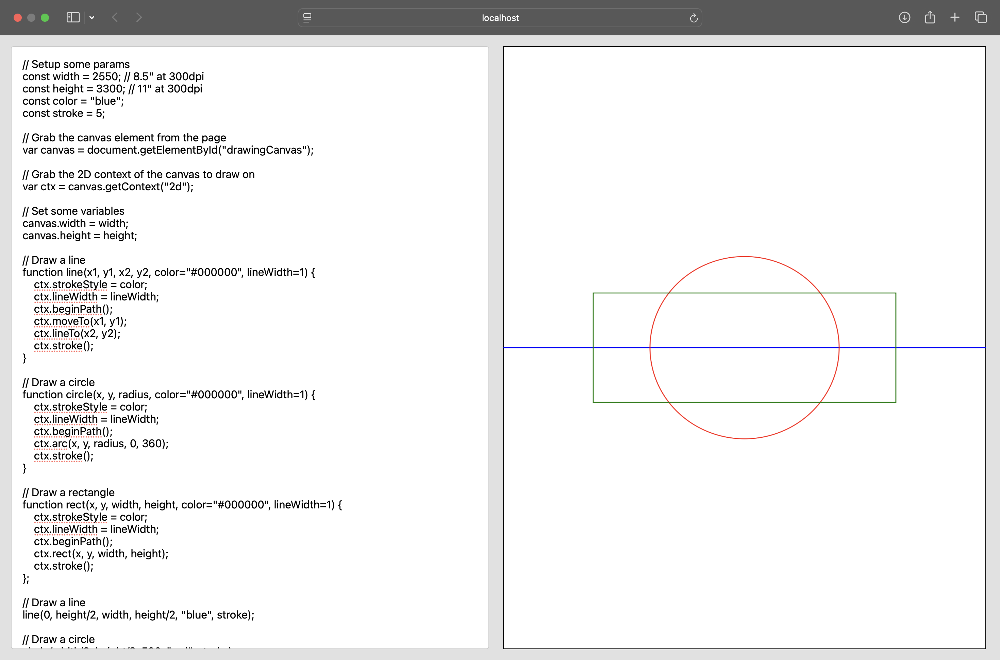

# OpenDraw

OpenDraw is a code based drawing tool. It's inspired by my work on generative art and by the fantastic OpenSCAD project. OpenDraw is for 2D drawing of binary images by writing code.



This is a very early alpha release that I'm experimenting on. It is not year ready for others.


## Installing

OpenDraw is currently a single html file. You can download the file and double-click it to open it in your favorite browser. It doesn't work in Safari; where you'll need to run it in a server.

I might create a simple Go server that serves the file on localhost and is available for any OS. Then you can just download that binary and run it. I might need to figure out how to bundle the html file into the binary.


## Getting Started

Write code in the pane on the left. Click the pane on the right to render.

Here's a quick example program to get you started.

OpenDraw drawings are written in JavaScript. The program includes a few helper functions to make your drawing code more concise.

```JavaScript
// Setup some variables
const width = 2550;  // 8.5" at 300dpi
const height = 3300; // 11" at 300dpi

// Setup the canvas
canvas(width, height);

// Draw a line
line(0, height/2, width, height/2, "blue", stroke);

// Draw a circle
circle(width/2, height/2, 500, "red", stroke);

// Draw a rectangle
rectWidth = 1600;
rectHeight = 600;
box(width/2-rectWidth/2, height/2-rectHeight/2, rectWidth, rectHeight, "green", stroke);
```

Here's a full example in pure JavaScript with no helper functions. As you can see canvas drawing code is quite verbose.

```JavaScript
// Setup some params
const width = 2550; // 8.5" at 300dpi
const height = 3300; // 11" at 300dpi
const color = "blue";
const stroke = 5;

// Grab the canvas element from the page
var canvas = document.getElementById("drawingCanvas");

// Grab the 2D context of the canvas to draw on
var ctx = canvas.getContext("2d");

// Set some variables
canvas.width = width;
canvas.height = height;

// Draw a line
function line(x1, y1, x2, y2, color="#000000", lineWidth=1) {
    ctx.strokeStyle = color;
    ctx.lineWidth = lineWidth;
    ctx.beginPath();
    ctx.moveTo(x1, y1);
    ctx.lineTo(x2, y2);
    ctx.stroke();
}

// Draw a circle
function circle(x, y, radius, color="#000000", lineWidth=1) {
    ctx.strokeStyle = color;
    ctx.lineWidth = lineWidth;
    ctx.beginPath();
    ctx.arc(x, y, radius, 0, 360);
    ctx.stroke();
}

// Draw a rectangle
function rect(x, y, width, height, color="#000000", lineWidth=1) {
    ctx.strokeStyle = color;
    ctx.lineWidth = lineWidth;
    ctx.beginPath();
    ctx.rect(x, y, width, height);
    ctx.stroke();
};

// Draw a line
line(0, height/2, width, height/2, "blue", stroke);

// Draw a circle
circle(width/2, height/2, 500, "red", stroke);

// Draw a rectangle
rectWidth = 1600;
rectHeight = 600;
rect(width/2-rectWidth/2, height/2-rectHeight/2, rectWidth, rectHeight, "green", stroke);
```


## Notes

_Created by Joel Dare on December 16, 2024._
